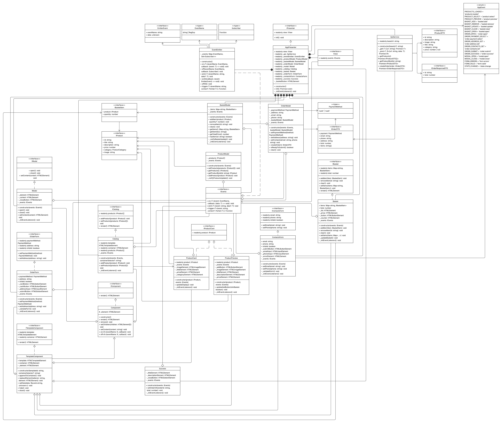

# Проектная работа "Веб-ларек"

Проект интернет-магазина с каталогом товаров, корзиной и оформлением заказа.

## Технологии

- HTML
- SCSS
- TypeScript
- Webpack
- MVP архитектура с брокером событий

Структура проекта:
- src/ — исходные файлы проекта
- src/components/ — папка с JS компонентами
- src/components/base/ — папка с базовым кодом

Важные файлы:
- src/pages/index.html — HTML-файл главной страницы
- src/types/index.ts — файл с типами
- src/index.ts — точка входа приложения
- src/scss/styles.scss — корневой файл стилей
- src/utils/constants.ts — файл с константами
- src/utils/utils.ts — файл с утилитами
- src/components/base/ — папка с базовым кодом

## Конфигурация

Проект использует переменные окружения для настройки API:
```
bash
# .env файл
API_ORIGIN=https://larek-api.nomoreparties.co
```
Скопируйте `.env.example` в `.env` и настройте переменные согласно вашему окружению.

## Установка и запуск
Для установки и запуска проекта необходимо выполнить команды

```bash
  npm install
```
```bash
  npm run start
```

или

```bash
  yarn
```

```bash
  yarn start
```
## Сборка

```bash
  npm run build
```

или

```bash
  yarn build
```

## Функциональность

- Просмотр каталога товаров
- Детальная информация о товаре
- Добавление/удаление товаров из корзины
- Оформление заказа
- Выбор способа оплаты
- Подтверждение заказа

## Архитектура

Проект построен на основе MVP (Model-View-Presenter) архитектуры с использованием брокера событий для взаимодействия между компонентами.



## Взаимодействие компонентов

### Схема взаимодействия

Приложение построено по принципу слабой связанности компонентов через брокер событий:

1. **AppPresenter** - центральный координатор, управляет всем взаимодействием между моделями и представлениями через EventEmitter
2. **Модели** уведомляют о изменениях через события:
   - `ProductModel` → `PRODUCTS_LOADED` при загрузке товаров
   - `CatalogModel` → `PRODUCTS_LOADED` при изменении каталога
   - `BasketModel` → `BASKET_UPDATE` при изменении корзины
   - `OrderModel` → `ORDER_UPDATE` при изменении заказа

3. **Представления** реагируют на события и отправляют пользовательские действия:
   - `Catalog` отображает товары из модели каталога
   - `ProductPreview` отправляет `BASKET_ADD` при добавлении товара
   - `Basket` отправляет `BASKET_REMOVE` и `ORDER_OPEN`
   - `OrderForm`/`ContactsForm` отправляют данные заказа

### Поток данных
```
Инициализация:
API → ProductModel/CatalogModel → PRODUCTS_LOADED → Catalog → ProductCard

Выбор товара:
ProductCard → PRODUCT_SELECT → ProductPreview → BASKET_ADD → BasketModel

Корзина:
BasketModel → BASKET_UPDATE → Basket/BasketCounter → ORDER_OPEN → OrderForm

Оформление заказа:
OrderForm → ORDER_SUBMIT → ContactsForm → ORDER_CONFIRM → API → Success
```
### Последовательность действий (основные сценарии)

#### Добавление товара в корзину:
1. Пользователь кликает по карточке товара
2. `ProductCard` → отправляет `PRODUCT_SELECT`
3. `AppPresenter` → создает `ProductPreview` и открывает модальное окно
4. Пользователь нажимает "В корзину" 
5. `ProductPreview` → отправляет `BASKET_ADD`
6. `AppPresenter` → добавляет товар в `BasketModel`
7. `BasketModel` → отправляет `BASKET_UPDATE`
8. `Basket` и `BasketCounter` обновляют отображение

#### Оформление заказа:
1. Пользователь открывает корзину и нажимает "Оформить"
2. `Basket` → отправляет `ORDER_OPEN`
3. `AppPresenter` → открывает `OrderForm`
4. Пользователь заполняет данные и нажимает "Далее"
5. `OrderForm` → отправляет `ORDER_SUBMIT`
6. `AppPresenter` → открывает `ContactsForm`
7. Пользователь заполняет контакты и нажимает "Оплатить"
8. `ContactsForm` → отправляет `ORDER_CONFIRM`
9. `AppPresenter` → создает заказ через API
10. `ApiService` → возвращает результат
11. `AppPresenter` → очищает корзину и заказ, показывает `Success`

## Программный интерфейс компонентов

### Примеры использования API

#### Работа с корзиной
```typescript
// Создание модели корзины
const basketModel = new BasketModel(eventEmitter);

// Добавление товара
basketModel.addItem(product);

// Проверка наличия товара
if (basketModel.hasItem(productId)) {
// товар уже в корзине
}

// Получение общей стоимости
const total = basketModel.getTotalPrice();

// Получение количества товаров
const count = basketModel.getItemCount();

// Очистка корзины
basketModel.clear();
```
#### Работа с событиями
```typescript
// Подписка на обновление корзины
events.on<IBasketUpdateEvent>(AppEvent.BASKET_UPDATE, (data) => {
console.log(`В корзине ${data.count} товаров на сумму ${data.total}`);
});

// Отправка события выбора товара
events.emit<IProductSelectEvent>(AppEvent.PRODUCT_SELECT, {
productId: 'product-123'
});

// Создание триггера события
const basketAddTrigger = events.trigger<IBasketAddEvent>(AppEvent.BASKET_ADD);
button.addEventListener('click', basketAddTrigger);
```
#### Работа с формами
```typescript
// Создание формы заказа
const orderForm = new OrderForm(events, orderModel);

// Установка способа оплаты
orderForm.setPaymentMethod('online');

// Установка адреса
orderForm.setAddress('ул. Примерная, д. 1');

// Проверка валидности
if (orderModel.isValid()) {
// форма готова к отправке
}
```
#### Работа с модальными окнами
```typescript
// Создание модального окна
const modal = new Modal(events);

// Открытие с содержимым
modal.open(productPreview.render());

// Закрытие через событие
events.emit<EmptyEvent>(AppEvent.MODAL_CLOSE, {});
```
#### Работа с каталогом
```typescript
// Создание модели каталога
const catalogModel = new CatalogModel(events);

// Создание каталога с фабрикой карточек
const catalog = new Catalog(
  events,
  (productId: string) => new ProductCard(productId, events, getProduct),
  '.gallery'
);

// Отображение продуктов в каталоге
catalog.renderProducts(catalogModel.products);

// Обновление существующих карточек
catalog.updateView();
```
## Обработка ошибок

### Стратегии обработки ошибок

1. **Ошибки API**:
- Сетевые ошибки перехватываются в `Api.handleResponse()`
- Ошибки от сервера извлекаются из поля `error` JSON-ответа или используется `response.statusText`
- При ошибке загрузки товаров приложение выводит сообщение в консоль

2. **Ошибки инициализации компонентов**:
- Отсутствие DOM-элементов генерирует исключения при создании компонентов
- Отсутствие шаблонов блокирует работу `TemplateComponent`

3. **Ошибки валидации форм**:
- Клиентская валидация в `OrderModel.isValid()`
- Блокировка кнопок отправки при невалидных данных
- Визуальная индикация ошибок в формах

### Примеры обработки

```typescript
// В базовом классе Api
protected handleResponse(response: Response): Promise<object> {
  if (response.ok) return response.json();
  else return response.json()
    .then(data => Promise.reject(data.error ?? response.statusText));
}

// В ApiService при получении товаров
async getProducts(): Promise<IProductDTO[]> {
  try {
    const data = await this.get(API_URL.PRODUCTS) as IProductsResponseDTO;
    return data.items;
  } catch (error) {
    console.error('Ошибка при получении списка товаров:', error);
    throw error;
  }
}

// В ApiService при создании заказа
async createOrder(order: IOrderDTO): Promise<IOrderResponseDTO> {
  try {
    return await this.post(API_URL.ORDERS, order) as IOrderResponseDTO;
  } catch (error) {
    console.error('Ошибка при оформлении заказа:', error);
    throw error;
  }
}
```
## Описание компонентов

### Базовые компоненты

---
#### Component
**Назначение**: Базовый абстрактный класс для всех компонентов приложения. Предоставляет общие методы для работы с DOM-элементами и рендеринга.

**Свойства**:
- `_element: HTMLElement` - Основной DOM-элемент компонента

**Конструктор**:
- `constructor()` - Создает новый компонент с базовым div-элементом

**Методы**:
- `render(): HTMLElement` - Возвращает DOM-элемент компонента для отображения
- `remove(): void` - Удаляет элемент из DOM
- `setChildren(children: HTMLElement[]): void` - Устанавливает дочерние элементы
- `setContent(content: string): void` - Устанавливает содержимое элемента
- `on<K>(eventName: K, callback: (event: HTMLElementEventMap[K]) => void): void` - Добавляет обработчик события
- `off<K>(eventName: K, callback: (event: HTMLElementEventMap[K]) => void): void` - Удаляет обработчик события

---
#### TemplateComponent
**Назначение**: Расширяет Component для работы с HTML-шаблонами. Используется компонентами, которые создаются на основе `<template>` элементов.

**Свойства**:
- `template: HTMLTemplateElement` - HTML-шаблон компонента
- `container: HTMLElement` - Контейнер для размещения компонента

**Конструктор**:
- `constructor(templateId: string, containerSelector?: string)` - Создает компонент на основе шаблона
  - `templateId: string` - ID шаблона в DOM
  - `containerSelector?: string` - Селектор контейнера (по умолчанию document.body)

**Методы**:
- `appendToContainer(): void` - Вставляет компонент в контейнер
- `replaceElement(selector: string, element: HTMLElement): void` - Заменяет элемент внутри компонента
- `setData(data: Record<string, unknown>): void` - Устанавливает данные для шаблона
- `hide(): void` - Скрывает компонент
- `show(): void` - Показывает компонент

---
#### AbstractProductView
**Назначение**: Абстрактный базовый класс для компонентов, отображающих информацию о товаре. Обеспечивает единообразную работу с данными товара.

**Свойства**:
- `productId: string` - Идентификатор товара
- `_events: IEvents` - Брокер событий
- `_getProduct: (id: string) => IProduct` - Функция получения данных товара

**Конструктор**:
- `constructor(productId: string, events: IEvents, getProduct: (id: string) => IProduct | null)` - Инициализирует представление товара
  - `productId: string` - Идентификатор товара
  - `events: IEvents` - Брокер событий
  - `getProduct: (id: string) => IProduct | null` - Функция получения товара

**Методы**:
- `getProduct(): IProduct | null` - Получает данные товара по ID
- `update(): void` - Обновляет отображение компонента

---
#### EventEmitter
**Назначение**: Брокер событий для обеспечения слабо связанного взаимодействия между компонентами системы.

**Свойства**:
- `_events: Map<EventName, Set<Subscriber>>` - Хранилище подписчиков на события

**Конструктор**:
- `constructor()` - Создает новый экземпляр брокера событий

**Методы**:
- `on<T>(event: EventName, callback: (data: T) => void): void` - Подписка на событие
- `emit<T>(event: string, data?: T): void` - Инициирование события
- `off(eventName: EventName, callback: Subscriber): void` - Отписка от события
- `trigger<T>(eventName: string, context?: Partial<T>): (event: object) => void` - Создание триггера события
- `onAll(callback: (event: EmitterEvent) => void): void` - Подписка на все события
- `offAll(): void` - Удаление всех обработчиков

### Компоненты пользовательского интерфейса

---
#### Catalog
**Назначение**: Компонент для отображения каталога товаров. Отображает продукты из модели каталога.

**Свойства**:
- `_cards: ProductCard[]` - Внутренний массив карточек товаров
- `container: HTMLElement` - Контейнер для размещения каталога
- `template: HTMLTemplateElement` - Шаблон каталога (null для данного компонента)
- `events: IEvents` - Брокер событий

**Конструктор**:
- `constructor(events: IEvents, cardFactory: (productId: string) => ProductCard, containerSelector: string)` - Создает каталог товаров
  - `events: IEvents` - Брокер событий
  - `cardFactory: (productId: string) => ProductCard` - Фабрика создания карточек
  - `containerSelector: string` - Селектор контейнера галереи (по умолчанию `.gallery`)

**Методы**:
- `renderProducts(products: IProduct[]): void` - Отображает список продуктов в каталоге
- `updateView(): void` - Обновляет отображение всех карточек без их пересоздания
- `clear(): void` - Очищает каталог

---
#### ProductCard
**Назначение**: Компонент карточки товара в каталоге. Отображает краткую информацию о товаре и обрабатывает клики для выбора товара.

**Свойства**:
- `productId: string` - Идентификатор товара
- `_categoryElement: HTMLElement` - Элемент категории товара
- `_titleElement: HTMLElement` - Элемент названия товара
- `_imageElement: HTMLImageElement` - Элемент изображения товара
- `_priceElement: HTMLElement` - Элемент цены товара

**Конструктор**:
- `constructor(productId: string, events: IEvents, getProduct: (id: string) => IProduct | null)` - Создает карточку товара
  - `productId: string` - Идентификатор товара
  - `events: IEvents` - Брокер событий
  - `getProduct: (id: string) => IProduct | null` - Функция получения данных товара

**Методы**:
- `update(): void` - Обновляет отображение карточки
- `render(): HTMLElement` - Возвращает DOM-элемент карточки
- `setClickHandler(): void` - Устанавливает обработчик клика

---
#### ProductPreview
**Назначение**: Компонент детального просмотра товара в модальном окне. Показывает полную информацию о товаре и кнопку добавления в корзину.

**Свойства**:
- `_descriptionElement: HTMLElement` - Элемент описания товара
- `_addButton: HTMLButtonElement` - Кнопка добавления в корзину
- `_isInBasket: (productId: string) => boolean` - Функция проверки наличия в корзине

**Конструктор**:
- `constructor(productId: string, events: IEvents, getProduct: (id: string) => IProduct | null, isInBasket: (productId: string) => boolean)` - Создает превью товара
  - `productId: string` - Идентификатор товара
  - `events: IEvents` - Брокер событий
  - `getProduct: (id: string) => IProduct | null` - Функция получения данных товара
  - `isInBasket: (productId: string) => boolean` - Функция проверки наличия в корзине

**Методы**:
- `update(): void` - Обновляет состояние кнопки и информацию
- `render(): HTMLElement` - Возвращает DOM-элемент превью
- `updateButtonState(): void` - Обновляет состояние кнопки добавления

---
#### Basket
**Назначение**: Компонент корзины покупок. Отображает список добавленных товаров, общую стоимость и кнопку оформления заказа.

**Свойства**:
- `_list: HTMLElement` - Контейнер списка товаров
- `_price: HTMLElement` - Элемент общей стоимости
- `_button: HTMLButtonElement` - Кнопка оформления заказа

**Конструктор**:
- `constructor(events: IEvents)` - Создает компонент корзины
  - `events: IEvents` - Брокер событий для взаимодействия с другими компонентами

**Методы**:
- `render(): HTMLElement` - Возвращает DOM-элемент корзины
- `_updateDisplay(items: IProduct[], total: number, count: number): void` - Обновляет отображение корзины
- `_initEventListeners(): void` - Инициализирует обработчики событий

---
#### BasketCounter
**Назначение**: Компонент счетчика товаров в корзине. Отображается в шапке сайта рядом с иконкой корзины.

**Свойства**:
- `_counter: HTMLElement` - Элемент счетчика

**Конструктор**:
- `constructor(events: IEvents)` - Создает счетчик корзины
  - `events: IEvents` - Брокер событий для получения обновлений корзины

**Методы**:
- `_updateCounter(count: number): void` - Обновляет отображаемое количество товаров
- `_initEventListeners(): void` - Инициализирует обработчики событий

---
#### Modal
**Назначение**: Компонент модального окна. Управляет отображением и закрытием модальных окон с различным содержимым.

**Свойства**:
- `_modal: HTMLElement` - Элемент модального окна
- `_content: HTMLElement` - Контейнер содержимого модального окна
- `_closeButton: HTMLElement` - Кнопка закрытия

**Конструктор**:
- `constructor(events: IEvents)` - Создает модальное окно
  - `events: IEvents` - Брокер событий для управления модальным окном

**Методы**:
- `open(content: HTMLElement): void` - Открывает модальное окно с содержимым
- `close(): void` - Закрывает модальное окно
- `render(): HTMLElement` - Возвращает DOM-элемент модального окна
- `setContent(content: HTMLElement): void` - Устанавливает содержимое модального окна

---
#### OrderForm
**Назначение**: Компонент формы оформления заказа. Позволяет выбрать способ оплаты и указать адрес доставки.

**Свойства**:
- `_paymentButtons: HTMLButtonElement[]` - Кнопки выбора способа оплаты
- `_addressInput: HTMLInputElement` - Поле ввода адреса
- `_submitButton: HTMLButtonElement` - Кнопка продолжения оформления
- `_orderModel: OrderModel` - Модель заказа

**Конструктор**:
- `constructor(events: IEvents, orderModel: OrderModel)` - Создает форму заказа
  - `events: IEvents` - Брокер событий
  - `orderModel: OrderModel` - Модель заказа для управления данными

**Методы**:
- `render(): HTMLElement` - Возвращает DOM-элемент формы
- `setPaymentMethod(method: PaymentMethod): void` - Устанавливает способ оплаты
- `setAddress(address: string): void` - Устанавливает адрес доставки
- `updateValidation(): void` - Обновляет состояние валидации формы

---
#### ContactsForm
**Назначение**: Компонент формы контактной информации. Собирает email и телефон покупателя для завершения оформления заказа.

**Свойства**:
- `_emailInput: HTMLInputElement` - Поле ввода email
- `_phoneInput: HTMLInputElement` - Поле ввода телефона
- `_submitButton: HTMLButtonElement` - Кнопка подтверждения заказа
- `_orderModel: OrderModel` - Модель заказа

**Конструктор**:
- `constructor(events: IEvents, orderModel: OrderModel)` - Создает форму контактов
  - `events: IEvents` - Брокер событий
  - `orderModel: OrderModel` - Модель заказа для управления контактными данными

**Методы**:
- `render(): HTMLElement` - Возвращает DOM-элемент формы
- `setEmail(email: string): void` - Устанавливает email
- `setPhone(phone: string): void` - Устанавливает телефон
- `updateValidState(isValid: boolean): void` - Обновляет состояние валидации

---
#### Success
**Назначение**: Компонент страницы успешного оформления заказа. Показывает информацию о созданном заказе и кнопку возврата к каталогу.

**Свойства**:
- `_totalElement: HTMLElement` - Элемент отображения суммы заказа
- `_closeButton: HTMLButtonElement` - Кнопка закрытия

**Конструктор**:
- `constructor(events: IEvents)` - Создает страницу успеха
  - `events: IEvents` - Брокер событий для закрытия модального окна

**Методы**:
- `render(): HTMLElement` - Возвращает DOM-элемент страницы успеха
- `setTotal(total: number): void` - Устанавливает сумму заказа

## Модели данных

### Observable
**Назначение**: Базовый класс для наблюдаемых моделей. Предоставляет механизм уведомления подписчиков об изменениях.

**Свойства**:
- `_events: IEvents` - Брокер событий

**Конструктор**:
- `constructor(events: IEvents)` - Создает наблюдаемую модель
  - `events: IEvents` - Брокер событий для уведомлений

**Методы**:
- `_notifyChange<T>(eventName: T, data?: IEventPayloadMap[T]): void` - Уведомляет подписчиков об изменениях

### BasketModel
**Назначение**: Модель корзины покупок. Управляет состоянием корзины, добавлением и удалением товаров, расчетом общей стоимости.

**Свойства**:
- `_items: Map<string, IProduct>` - Товары в корзине

**Конструктор**:
- `constructor(events: IEvents)` - Создает модель корзины
  - `events: IEvents` - Брокер событий для уведомления об изменениях

**Методы**:
- `addItem(product: IProduct): void` - Добавляет товар в корзину
- `removeItem(id: string): void` - Удаляет товар из корзины
- `hasItem(id: string): boolean` - Проверяет наличие товара в корзине
- `getItemsArray(): IProduct[]` - Возвращает список товаров в корзине
- `getItemIds(): string[]` - Возвращает список ID товаров
- `getItemCount(): number` - Возвращает количество товаров
- `getTotalPrice(): number` - Возвращает общую стоимость
- `clear(): void` - Очищает корзину
- `_notifyBasketUpdate(): void` - Уведомляет об изменениях в корзине

### ProductModel
**Назначение**: Модель товаров. Управляет коллекцией товаров, предоставляет методы для поиска и фильтрации товаров.

**Свойства**:
- `_products: Map<string, IProduct>` - Коллекция товаров

**Конструктор**:
- `constructor(events: IEvents)` - Создает модель товаров
  - `events: IEvents` - Брокер событий для уведомления о загрузке товаров

**Методы**:
- `setProducts(products: IProduct[]): void` - Устанавливает список товаров
- `getProduct(id: string): IProduct | null` - Получает товар по ID
- `getProducts(): IProduct[]` - Возвращает все товары
- `addProduct(product: IProduct): void` - Добавляет товар в коллекцию

### CatalogModel
**Назначение**: Модель каталога товаров. Управляет отображаемыми товарами и предоставляет методы для работы с каталогом.

**Свойства**:
- `_products: IProduct[]` - Список товаров в каталоге

**Конструктор**:
- `constructor(events: IEvents)` - Создает модель каталога
  - `events: IEvents` - Брокер событий для уведомления об изменениях в каталоге

**Методы**:
- `products: IProduct[]` - Геттер для получения списка товаров
- `setProducts(products: IProduct[]): void` - Устанавливает список товаров
- `addProduct(product: IProduct): void` - Добавляет товар в каталог
- `removeProduct(productId: string): void` - Удаляет товар из каталога
- `clear(): void` - Очищает каталог
- `getProductById(id: string): IProduct | null` - Получает товар по ID

### OrderModel
**Назначение**: Модель заказа. Управляет данными заказа: адрес, контакты, способ оплаты. Выполняет валидацию данных.

**Свойства**:
- `_address: string` - Адрес доставки
- `_email: string` - Email покупателя
- `_phone: string` - Телефон покупателя
- `_paymentMethod: PaymentMethod | null` - Способ оплаты

**Конструктор**:
- `constructor(events: IEvents)` - Создает модель заказа
  - `events: IEvents` - Брокер событий для уведомления об изменениях

**Методы**:
- `setAddress(address: string): void` - Устанавливает адрес доставки
- `setContacts(email: string, phone: string): void` - Устанавливает контактные данные
- `setPaymentMethod(method: PaymentMethod): void` - Устанавливает способ оплаты
- `getAddress(): string` - Возвращает адрес
- `getEmail(): string` - Возвращает email
- `getPhone(): string` - Возвращает телефон
- `getPaymentMethod(): PaymentMethod | null` - Возвращает способ оплаты
- `isValid(): boolean` - Проверяет валидность данных заказа
- `clear(): void` - Очищает данные заказа

## Сервисы

### ApiService
**Назначение**: Сервис для взаимодействия с API сервера. Наследуется от базового класса `Api` и реализует методы для получения товаров и создания заказов.

**Свойства**:
- `baseUrl: string` - Базовый URL API (наследуется от Api)
- `options: RequestInit` - Настройки запросов (наследуется от Api)

**Конструктор**:
- `constructor(baseUrl: string = API_URL.BASE_URL)` - Создает сервис API с базовым URL

**Методы**:
- `getProducts(): Promise<IProductDTO[]>` - Получает список товаров с сервера
- `createOrder(order: IOrderDTO): Promise<IOrderResponseDTO>` - Отправляет заказ на сервер

### Api
**Назначение**: Базовый класс для работы с HTTP API. Предоставляет методы для выполнения GET и POST запросов с обработкой ошибок.

**Свойства**:
- `baseUrl: string` - Базовый URL для всех запросов
- `options: RequestInit` - Общие настройки для всех запросов

**Конструктор**:
- `constructor(baseUrl: string, options: RequestInit = {})` - Создает экземпляр API клиента
    - `baseUrl: string` - Базовый URL API
    - `options: RequestInit` - Дополнительные настройки запросов

**Методы**:
- `handleResponse(response: Response): Promise<object>` - Обрабатывает ответ от сервера
- `get(uri: string): Promise<object>` - Выполняет GET запрос
- `post(uri: string, data: object, method: ApiPostMethods = 'POST'): Promise<object>` - Выполняет POST/PUT/DELETE запрос

## Презентер

### AppPresenter
**Назначение**: Главный презентер приложения. Координирует взаимодействие между моделями и представлениями, обрабатывает события и управляет бизнес-логикой.

**Свойства**:
- `view: IView` - Интерфейс представления
- `_api: ApiService` - Сервис API
- `_eventEmitter: EventEmitter` - Брокер событий
- `_productModel: ProductModel` - Модель товаров
- `_basketModel: BasketModel` - Модель корзины
- `_orderModel: OrderModel` - Модель заказа
- Компоненты представления: `_modal`, `_catalog`, `_basket`, `_orderForm`, `_contactsForm`, `_success`
- `_basketButton: HTMLElement` - Кнопка корзины в шапке
- `_basketCounter: BasketCounter` - Счетчик товаров в корзине

**Конструктор**:
- `constructor()` - Создает главный презентер приложения
  - Инициализирует все модели, компоненты и настраивает обработчики событий

**Методы**:
- `init(): Promise<void>` - Инициализирует приложение
- `_initEventListeners(): void` - Настраивает обработчики событий
- `_createOrderDTO(): IOrderDTO | null` - Создает объект заказа для API
- `_mapProductDTOToProduct(dto: IProductDTO): IProduct` - Преобразует DTO в модель

## Используемые типы данных

### Ключевые типы данных

#### IProductBase
```typescript
interface IProductBase {
  id: string;           // Уникальный идентификатор товара
  description: string;  // Описание товара
  image: string;        // URL изображения товара
  title: string;        // Название товара
  price: number;        // Цена товара
}
```
#### IProduct
```typescript
interface IProduct extends IProductBase {
  category: ProductCategory; // Категория товара (локализованная)
}
```
#### IProductDTO
```typescript
interface IProductDTO extends IProductBase {
  category: string;     // Категория товара (строка от API)
}
```
#### IContactInfo
```typescript
interface IContactInfo {
  email: string;        // Email покупателя
  phone: string;        // Телефон покупателя
  address: string;      // Адрес доставки
}
```
#### IUser
```typescript
interface IUser extends IContactInfo {
  payment: PaymentMethod; // Способ оплаты
}
```
#### IOrderDTO
```typescript
interface IOrderDTO extends IContactInfo {
  payment: PaymentMethod; // Способ оплаты
  total: number;          // Общая стоимость заказа
  items: string[];        // Массив ID товаров
}
```
#### IOrderResponseDTO
```typescript
interface IOrderResponseDTO {
  id: string;           // ID созданного заказа
  total: number;        // Общая сумма заказа
}
```
#### IApi
```typescript
interface IApi {
  getProducts(): Promise<IProductDTO[]>;        // Получение списка товаров с сервера
  createOrder(order: IOrderDTO): Promise<IOrderResponseDTO>; // Создание заказа на сервере
}

#### ICatalogModel
```typescript
interface ICatalogModel {
  readonly products: IProduct[];                  // Список товаров в каталоге
  setProducts(products: IProduct[]): void;        // Устанавливает список товаров
  addProduct(product: IProduct): void;            // Добавляет товар в каталог
  removeProduct(productId: string): void;         // Удаляет товар из каталога
  clear(): void;                                  // Очищает каталог
  getProductById(id: string): IProduct | null;    // Получает товар по ID
}
```
#### IProductsResponseDTO
```typescript
interface IProductsResponseDTO {
  total: number;        // Общее количество товаров
  items: IProductDTO[]; // Массив товаров
}
```
### Типы данных

#### ProductCategory
```typescript
type ProductCategory =
  | 'софт-скил'
  | 'хард-скил'
  | 'другое'
  | 'кнопка'
  | 'дополнительное';
```
#### PaymentMethod
```typescript
type PaymentMethod = 'online' | 'cash';
```
### Интерфейсы компонентов

#### IComponent
```typescript
interface IComponent {
  render(): HTMLElement;  // Возвращает DOM-элемент компонента
}
```
#### ITemplateComponent
```typescript
interface ITemplateComponent extends IComponent {
  readonly template: HTMLTemplateElement; // HTML-шаблон
  readonly container: HTMLElement;        // Контейнер компонента
}
```
#### IModal
```typescript
interface IModal extends ITemplateComponent {
  open(): void;                          // Открывает модальное окно
  close(): void;                         // Закрывает модальное окно
  setContent(content: HTMLElement): void; // Устанавливает содержимое
}
```
#### IProductCard
```typescript
interface IProductCard extends ITemplateComponent {
  readonly product: IProduct;                   // Товар, отображаемый в карточке
  update(): void;                              // Обновление отображения карточки
}
```
#### ICatalog
```typescript
interface ICatalog extends ITemplateComponent {
  renderProducts(products: IProduct[]): void;       // Отображает продукты в каталоге
  updateView(): void;                              // Обновляет отображение
  clear(): void;                                    // Очищает каталог
}
```
#### IOrderForm
```typescript
interface IOrderForm extends ITemplateComponent {
  readonly paymentMethod: PaymentMethod | null; // Выбранный способ оплаты
  readonly address: string;                      // Адрес доставки
  readonly isValid: boolean;                     // Валидность формы
  setPaymentMethod(method: PaymentMethod): void; // Устанавливает способ оплаты
  setAddress(address: string): void;             // Устанавливает адрес
}
```
#### IContactsForm
```typescript
interface IContactsForm extends ITemplateComponent {
  readonly email: string;           // Email
  readonly phone: string;           // Телефон
  readonly isValid: boolean;        // Валидность формы
  setEmail(email: string): void;    // Устанавливает email
  setPhone(phone: string): void;    // Устанавливает телефон
}
```
#### IView
```typescript
interface IView {
  readonly events: IEvents; // Брокер событий
}
```
#### IPresenter
```typescript
interface IPresenter {
  readonly view: IView;     // Представление
  init(): void;             // Инициализация презентера
}
```
### События приложения

#### AppEvent
```typescript
enum AppEvent {
// События каталога
  PRODUCTS_LOADED = 'products:loaded',    // Товары загружены
  PRODUCT_SELECT = 'product:select',      // Товар выбран
  PRODUCT_PREVIEW = 'product:preview',    // Превью товара
  
  // События карточек
  CARDS_LOADED = 'cards:loaded',          // Карточки загружены
  CARD_ADD = 'card:add',                  // Карточка добавлена
  CARD_REMOVE = 'card:remove',            // Карточка удалена
  
  // События корзины
  BASKET_ADD = 'basket:add',              // Товар добавлен в корзину
  BASKET_REMOVE = 'basket:remove',        // Товар удален из корзины
  BASKET_UPDATE = 'basket:update',        // Корзина обновлена
  BASKET_CLEAR = 'basket:clear',          // Корзина очищена
  BASKET_OPEN = 'basket:open',            // Корзина открыта
  
  // События заказа
  ORDER_OPEN = 'order:open',              // Форма заказа открыта
  ORDER_SUBMIT = 'order:submit',          // Заказ отправлен
  ORDER_CONFIRM = 'order:confirm',        // Заказ подтвержден
  ORDER_SUCCESS = 'order:success',        // Заказ успешно создан
  ORDER_CLEAR = 'order:clear',            // Заказ очищен
  ORDER_UPDATE = 'order:update',          // Заказ обновлен
  ORDER_CONTACTS_SET = 'order:contacts:set', // Контакты установлены
  
  // События модального окна
  MODAL_OPEN = 'modal:open',              // Модальное окно открыто
  MODAL_CLOSE = 'modal:close',            // Модальное окно закрыто
}
```
### Типы событий

#### Типы данных событий
```typescript
interface IProductsLoadedEvent {
  products: IProduct[];     // Загруженные товары
}
```
#### ICardsLoadedEvent
```typescript
interface ICardsLoadedEvent {
  cards: ProductCard[];     // Загруженные карточки
}
```
#### ICardAddEvent
```typescript
interface ICardAddEvent {
  card: ProductCard;        // Добавленная карточка
}
```
#### ICardRemoveEvent
```typescript
interface ICardRemoveEvent {
  card: ProductCard;        // Удаленная карточка
}
```
#### IProductSelectEvent
```typescript
interface IProductSelectEvent {
  productId: string;        // ID выбранного товара
}
```
#### IBasketAddEvent
```typescript
interface IBasketAddEvent {
  productId: string;        // ID добавляемого товара
}
```
#### IBasketRemoveEvent
```typescript
interface IBasketRemoveEvent {
  productId: string;        // ID удаляемого товара
}
```
#### IBasketUpdateEvent
```typescript
interface IBasketUpdateEvent {
  items: IProduct[];        // Товары в корзине
  total: number;            // Общая стоимость
  count: number;            // Количество товаров
}
```
#### IOrderUpdateEvent
```typescript
interface IOrderUpdateEvent {
  items: string[];          // ID товаров в заказе
  total: number;            // Общая стоимость заказа
}
```
#### IOrderPaymentSelectEvent
```typescript
interface IOrderPaymentSelectEvent {
  method: PaymentMethod;    // Выбранный способ оплаты
}
```
#### IOrderAddressSetEvent
```typescript
interface IOrderAddressSetEvent {
  address: string;          // Установленный адрес
}
```
#### IOrderContactsSetEvent
```typescript
interface IOrderContactsSetEvent {
  email: string;            // Email покупателя
  phone: string;            // Телефон покупателя
}
```
#### IOrderSubmitEvent
```typescript
interface IOrderSubmitEvent {
  order: IOrderDTO;         // Данные заказа для отправки
}
```
#### IOrderSuccessEvent
```typescript
interface IOrderSuccessEvent {
  orderId: string;          // ID созданного заказа
  total: number;            // Общая сумма заказа
}
```
#### IModalOpenEvent
```typescript
interface IModalOpenEvent {
  content: HTMLElement;     // Содержимое модального окна
}
```
#### IFormErrorsEvent
```typescript
interface IFormErrorsEvent {
  errors: string[];         // Массив ошибок валидации
}
```
#### IOrderFormValidEvent
```typescript
interface IOrderFormValidEvent {
  isValid: boolean;         // Валидность формы заказа
}
```
#### IOrderFormErrorsEvent
```typescript
interface IOrderFormErrorsEvent {
  errors: string[];         // Ошибки формы заказа
}
```
#### IContactsFormValidEvent
```typescript
interface IContactsFormValidEvent {
  isValid: boolean;         // Валидность формы контактов
}
```
#### IContactsFormErrorsEvent
```typescript
interface IContactsFormErrorsEvent {
  errors: string[];         // Ошибки формы контактов
}
```
#### EmptyEvent
```typescript
type EmptyEvent = Record<string, never>; // Событие без данных
```


### Карта событий

#### IEventPayloadMap
```typescript
interface IEventPayloadMap {
  [AppEvent.PRODUCTS_LOADED]: IProductsLoadedEvent;
  [AppEvent.CARDS_LOADED]: ICardsLoadedEvent;
  [AppEvent.CARD_ADD]: ICardAddEvent;
  [AppEvent.CARD_REMOVE]: ICardRemoveEvent;
  [AppEvent.PRODUCT_SELECT]: IProductSelectEvent;
  [AppEvent.PRODUCT_PREVIEW]: IProductSelectEvent;
  [AppEvent.BASKET_ADD]: IBasketAddEvent;
  [AppEvent.BASKET_REMOVE]: IBasketRemoveEvent;
  [AppEvent.BASKET_UPDATE]: IBasketUpdateEvent;
  [AppEvent.BASKET_CLEAR]: EmptyEvent;
  [AppEvent.BASKET_OPEN]: EmptyEvent;
  [AppEvent.ORDER_OPEN]: EmptyEvent;
  [AppEvent.ORDER_UPDATE]: IOrderUpdateEvent;
  [AppEvent.ORDER_PAYMENT_SELECT]: IOrderPaymentSelectEvent;
  [AppEvent.ORDER_ADDRESS_SET]: IOrderAddressSetEvent;
  [AppEvent.ORDER_CONTACTS_SET]: IOrderContactsSetEvent;
  [AppEvent.ORDER_CONFIRM]: EmptyEvent;
  [AppEvent.ORDER_SUBMIT]: IOrderSubmitEvent;
  [AppEvent.ORDER_SUCCESS]: IOrderSuccessEvent;
  [AppEvent.ORDER_CLEAR]: EmptyEvent;
  [AppEvent.MODAL_OPEN]: IModalOpenEvent;
  [AppEvent.MODAL_CLOSE]: EmptyEvent;
  [AppEvent.FORM_ERRORS]: IFormErrorsEvent;
  [AppEvent.FORM_VALID]: EmptyEvent;
  [AppEvent.ORDER_FORM_VALID]: IOrderFormValidEvent;
  [AppEvent.ORDER_FORM_ERRORS]: IOrderFormErrorsEvent;
  [AppEvent.CONTACTS_FORM_VALID]: IContactsFormValidEvent;
  [AppEvent.CONTACTS_FORM_ERRORS]: IContactsFormErrorsEvent;
}
```
